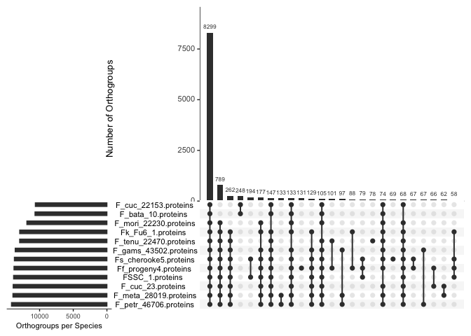
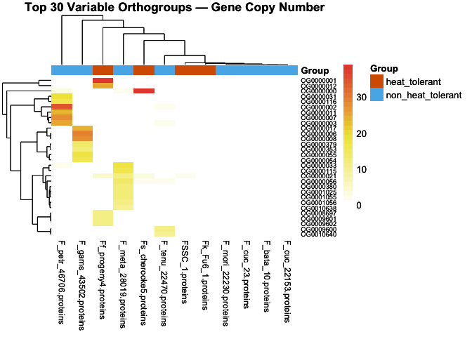
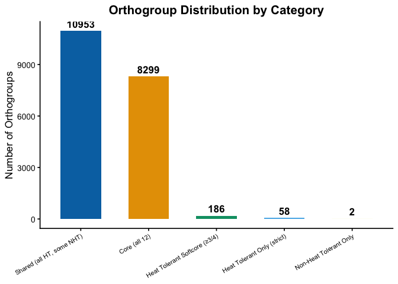

=========================================================== OrthoFinder
Downstream Analysis Heat Tolerant vs Non-Heat Tolerant Genomes
============================================================

\#Install required packages

    #install.packages(c("tidyverse", "ggplot2", "ggvenn", "pheatmap", "RColorBrewer", "UpSetR"))

\#Load the packages

    library(UpSetR)
    library(tidyverse)

    ## ── Attaching core tidyverse packages ──────────────────────── tidyverse 2.0.0 ──
    ## ✔ dplyr     1.2.0     ✔ readr     2.2.0
    ## ✔ forcats   1.0.1     ✔ stringr   1.6.0
    ## ✔ ggplot2   4.0.2     ✔ tibble    3.3.1
    ## ✔ lubridate 1.9.5     ✔ tidyr     1.3.2
    ## ✔ purrr     1.2.1     
    ## ── Conflicts ────────────────────────────────────────── tidyverse_conflicts() ──
    ## ✖ dplyr::filter() masks stats::filter()
    ## ✖ dplyr::lag()    masks stats::lag()
    ## ℹ Use the conflicted package (<http://conflicted.r-lib.org/>) to force all conflicts to become errors

    library(ggplot2)
    library(pheatmap)
    library(RColorBrewer)

\#Load the data

    ortho <- read.table("Data/Orthogroups.GeneCount.tsv",
                        header = TRUE, sep = "\t", row.names = 1)
    ortho <- ortho[, !colnames(ortho) %in% "Total"] #remove Total column if present
    meta <- read.csv("Data/metadata.csv")
    rownames(meta) <- meta$genome

    cbbPalette <- c("#000000", "#E69F00", "#56B4E9", "#009E73", "#F0E442", "#0072B2", "#D55E00", "#CC79A7")
    # Confirm column names match metadata
    all(colnames(ortho) %in% meta$genome)  # Should return TRUE

    ## [1] TRUE

    # Reorder metadata to match ortho column order
    meta <- meta[colnames(ortho), ]

    # Separate species by group
    heat_species     <- meta$genome[meta$group == "heat_tolerant"]
    non_heat_species <- meta$genome[meta$group == "non_heat_tolerant"]

\#Presence/absence matrix

    # Convert gene counts to presence (1) / absence (0)
    pa_matrix <- as.data.frame((ortho > 0) * 1)

    # ============================================================
    # 3. CORE, SHARED, AND UNIQUE ORTHOGROUPS
    # ============================================================

    # --- Core orthogroups: present in ALL 12 genomes ---
    core_OGs <- rownames(pa_matrix)[rowSums(pa_matrix) == ncol(pa_matrix)]
    cat("Core orthogroups (all 12 genomes):", length(core_OGs), "\n")

    ## Core orthogroups (all 12 genomes): 8299

    # --- Shared between ALL heat tolerant only (present in all 4 HT, absent in all 8 NHT) ---
    heat_present     <- rowSums(pa_matrix[, heat_species]) == length(heat_species)
    non_heat_absent  <- rowSums(pa_matrix[, non_heat_species]) == 0
    heat_unique_strict <- rownames(pa_matrix)[heat_present & non_heat_absent]
    cat("Orthogroups UNIQUE to ALL heat tolerant (strict):", length(heat_unique_strict), "\n")

    ## Orthogroups UNIQUE to ALL heat tolerant (strict): 58

    # --- Present in ALL heat tolerant (may also be in some non-HT) ---
    heat_core_OGs <- rownames(pa_matrix)[rowSums(pa_matrix[, heat_species]) == length(heat_species)]
    cat("Orthogroups in ALL heat tolerant genomes:", length(heat_core_OGs), "\n")

    ## Orthogroups in ALL heat tolerant genomes: 11011

    # --- Present in ALL non-heat tolerant only ---
    non_heat_present <- rowSums(pa_matrix[, non_heat_species]) == length(non_heat_species)
    heat_absent      <- rowSums(pa_matrix[, heat_species]) == 0
    non_heat_unique  <- rownames(pa_matrix)[non_heat_present & heat_absent]
    cat("Orthogroups UNIQUE to ALL non-heat tolerant:", length(non_heat_unique), "\n")

    ## Orthogroups UNIQUE to ALL non-heat tolerant: 2

    # --- Softcore: present in at least 3 of 4 heat tolerant ---
    heat_softcore <- rownames(pa_matrix)[rowSums(pa_matrix[, heat_species]) >= 3 &
                                         rowSums(pa_matrix[, non_heat_species]) == 0]
    cat("Orthogroups in ≥3 heat tolerant, absent in NHT:", length(heat_softcore), "\n")

    ## Orthogroups in ≥3 heat tolerant, absent in NHT: 186

\#Save the results

    # Save results
    write.csv(data.frame(Orthogroup = core_OGs),
              "core_orthogroups_all12.csv", row.names = FALSE)
    write.csv(data.frame(Orthogroup = heat_unique_strict),
              "orthogroups_unique_heat_tolerant.csv", row.names = FALSE)
    write.csv(data.frame(Orthogroup = non_heat_unique),
              "orthogroups_unique_non_heat_tolerant.csv", row.names = FALSE)
    write.csv(data.frame(Orthogroup = heat_softcore),
              "orthogroups_softcore_heat_tolerant.csv", row.names = FALSE)

\#Generating the Upset plot

    # Presence/absence per species (each species as a set)
    upset_data <- as.data.frame(t(pa_matrix))

    # Make each species a column (UpSetR needs species as columns)
    upset_input <- as.data.frame(pa_matrix)

    upsetplot <- upset(upset_input,
          sets = colnames(upset_input),
          nintersects = 25,
          order.by = "freq",
          decreasing = TRUE,
          mb.ratio = c(0.6, 0.4),
          number.angles = 0,
          text.scale = c(1.2, 1.2, 1, 1, 1.2, 1),
          mainbar.y.label = "Number of Orthogroups",
          sets.x.label = "Orthogroups per Species")

    ## Warning: `aes_string()` was deprecated in ggplot2 3.0.0.
    ## ℹ Please use tidy evaluation idioms with `aes()`.
    ## ℹ See also `vignette("ggplot2-in-packages")` for more information.
    ## ℹ The deprecated feature was likely used in the UpSetR package.
    ##   Please report the issue to the authors.
    ## This warning is displayed once per session.
    ## Call `lifecycle::last_lifecycle_warnings()` to see where this warning was
    ## generated.

    ## Warning: Using `size` aesthetic for lines was deprecated in ggplot2 3.4.0.
    ## ℹ Please use `linewidth` instead.
    ## ℹ The deprecated feature was likely used in the UpSetR package.
    ##   Please report the issue to the authors.
    ## This warning is displayed once per session.
    ## Call `lifecycle::last_lifecycle_warnings()` to see where this warning was
    ## generated.

    ## Warning: The `size` argument of `element_line()` is deprecated as of ggplot2 3.4.0.
    ## ℹ Please use the `linewidth` argument instead.
    ## ℹ The deprecated feature was likely used in the UpSetR package.
    ##   Please report the issue to the authors.
    ## This warning is displayed once per session.
    ## Call `lifecycle::last_lifecycle_warnings()` to see where this warning was
    ## generated.

    upsetplot

\#HEATMAP — Gene Copy Number Across Species

    # Use only orthogroups that differ between heat and non-heat
    # Filter for variable orthogroups (not all same value)
    variable_OGs <- ortho[apply(ortho, 1, var) > 0, ]

    # Take top 30 most variable for cleaner heatmap
    top_variable <- variable_OGs[order(apply(variable_OGs, 1, var),
                                       decreasing = TRUE), ][1:30, ]

    # Annotation for columns (species)
    col_annotation <- data.frame(Group = meta$group)
    rownames(col_annotation) <- meta$genome

    ann_colors <- list(Group = c(heat_tolerant     = "#D55E00",
                                  non_heat_tolerant = "#56B4E9"))

    heatmap <- pheatmap(top_variable,
             annotation_col = col_annotation,
             annotation_colors = ann_colors,
             color = colorRampPalette(c("white", "#F0E442", "#E74C3C"))(30),
             clustering_distance_rows = "euclidean",
             clustering_distance_cols = "euclidean",
             clustering_method = "complete",
             show_rownames = TRUE,
             show_colnames = TRUE,
             fontsize_col = 9,
             fontsize_row = 7,
             main = "Top 30 Variable Orthogroups — Gene Copy Number",
             border_color = NA)
    heatmap

\#Summary Bar Chart

    summary_df <- data.frame(
      Category = c("Core (all 12)",
                   "Heat Tolerant Only (strict)",
                   "Non-Heat Tolerant Only",
                   "Heat Tolerant Softcore (≥3/4)",
                   "Shared (all HT, some NHT)"),
      Count = c(length(core_OGs),
                length(heat_unique_strict),
                length(non_heat_unique),
                length(heat_softcore),
                sum(heat_present) - length(heat_unique_strict))
    )

    ggplot(summary_df, aes(x = reorder(Category, -Count), y = Count, fill = Category)) +
      geom_bar(stat = "identity", width = 0.6) +
      geom_text(aes(label = Count), vjust = -0.5, size = 4.5, fontface = "bold") +
      scale_fill_manual(values = c("#E69F00", "#56B4E9", "#009E73", "#F0E442", "#0072B2", "#D55E00")) +
      labs(title = "Orthogroup Distribution by Category",
           x = NULL, y = "Number of Orthogroups") +
      theme_classic(base_size = 13) +
      theme(legend.position = "none",
            axis.text.x = element_text(angle = 30, hjust = 1, size = 8),
            plot.title = element_text(hjust = 0.5, face = "bold")) 

 -
58 unique orthogroups were found strictly on the heat tolerant species.

\#Future work The genes within these group should be functionally
annotated and any genes that can have potential function relating to
heat tolerance can be further studied.

    print_tree <- function(path = ".", prefix = "") {
      files <- list.files(path, all.files = FALSE)
      
      for (i in seq_along(files)) {
        cat(prefix, "├── ", files[i], "\n", sep = "")
        
        full_path <- file.path(path, files[i])
        
        if (dir.exists(full_path)) {
          print_tree(full_path, paste0(prefix, "│   "))
        }
      }
    }

    # Run it
    print_tree()

    ## ├── core_orthogroups_all12.csv
    ## ├── Data
    ## │   ├── metadata.csv
    ## │   ├── Orthogroups.GeneCount.tsv
    ## │   ├── Orthogroups.tsv
    ## ├── Data_Analysis_HTproject_files
    ## │   ├── figure-markdown_strict
    ## │   │   ├── unnamed-chunk-7-1.png
    ## │   │   ├── unnamed-chunk-8-1.png
    ## │   │   ├── unnamed-chunk-9-1.png
    ## ├── Data_Analysis_HTproject.md
    ## ├── Data_Analysis_HTproject.Rmd
    ## ├── Fusarium_HeatTolerance.Rproj
    ## ├── HPC_scripts
    ## │   ├── Busco+basicstats.sh
    ## │   ├── Clean_sort_mask.sh
    ## │   ├── Orthofinder.sh
    ## │   ├── predict.sh
    ## ├── orthogroups_softcore_heat_tolerant.csv
    ## ├── orthogroups_unique_heat_tolerant.csv
    ## ├── orthogroups_unique_non_heat_tolerant.csv
    ## ├── README.html
    ## ├── README.md
    ## ├── Results
    ## │   ├── core_orthogroups_all12.csv
    ## │   ├── orthogroups_softcore_heat_tolerant.csv
    ## │   ├── orthogroups_unique_heat_tolerant.csv
    ## │   ├── orthogroups_unique_non_heat_tolerant.csv
